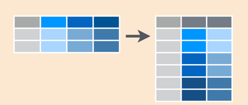

```{r setup_4, include=FALSE}
knitr::opts_chunk$set(echo = TRUE)
library(tidyverse)
library(tidylog, warn.conflicts = FALSE)
library(janitor)
library(readxl)
library(lubridate)
```

## A brief review of tidy data principles & the tidyverse

According to the official tidyverse [website](https://www.tidyverse.org/), "the tidyverse is an *opinionated* collection of R packages designed for data science." The bottom line is that the tidyverse offers a consistent interface for functions. Data is consistently the first argument for functions, and that enables compatibility with pipes. The tidyverse includes its own version of a data frame, the [tibble](http://tibble.tidyverse.org/articles/tibble.html), with the primary advantages being nicer printing of output and more predictable behavior with subsetting.

One of the key concepts of the tidyverse philosophy is maintaing "tidy" data. [Tidy data](http://r4ds.had.co.nz/tidy-data.html) is a data structure and a way of thinking about data that not only facilitates using tidyverse packages but more importantly it also provides a convention for organizing data that is amenable to data manipulation. The three criteria for tidy data are:
1. Each variable must have its own column.
2. Each observation must have its own row.
3. Each value must have its own cell.

As an example straight out of the [R for Data Science](http://r4ds.had.co.nz/tidy-data.html) text, consider a data set displaying 4 variables: country, year, population, and cases. One representation might split cases and population on different rows, even though each observation is a country and year:
```{r}
table2
```
Or case and population may be jammed together in one column:
```{r}
table3
```
The tidy representation is:
```{r}
table1
```
Each observation is on one row, and each column represents a variable, with no values being shoved together into a single column.

An advantage of using the tidyverse packages is the relatively robust support documentation around these packages. Stack Overflow is often a go to for troubleshooting but many tidyverse packages have nice vignettes and other online resources to help orient you to how the package functions work. There is a freely available online book, [R for Data Science](http://r4ds.had.co.nz/) that covers the tidyverse (and more). [Cheat Sheets](https://www.rstudio.com/resources/cheatsheets/) provided by RStudio also provide great quick references for tidyverse and other packages.

You can load the core tidyverse packages by loading tidyverse: `library(tidyverse)`. [ggplot2](http://ggplot2.tidyverse.org/) is probably the most popular tidyverse package and arguably the go to for sophisticated visualizations in R, but inevitably data will need to be manipulated prior to plotting. So the two workhorse packages for many applications are [dplyr](http://dplyr.tidyverse.org/) and [tidyr](http://tidyr.tidyverse.org/), which we will cover in this lesson.

## Manipulating data with dplyr

The [dplyr package](http://dplyr.tidyverse.org/) provides functions to carve, expand, and collapse a data frame (or tibble). To complement dplyr, we have also loaded the [tidylog package](https://github.com/elbersb/tidylog), which provides additional output to clarify exactly what the dplyr package did when you run certain commands.

### Select columns

Reducing a data set to a subset of columns and/or rows are common operations, particularly on the path to answering a specific set of questions about a data set. 

If you need to go from a large number of columns (variables) to a smaller set, `select()` allows you to select specific columns by name. 


Let's take these for a spin using the data we started examining in the last lesson.

Review the type of data we were working with:
```{r}
samples_jan <- read_csv("data/2017-01-06_s.csv",
  col_types = cols(
    compoundName = col_factor(NULL),
    sampleType = col_factor(NULL)
    )
  ) %>% 
  clean_names()
str(samples_jan)
```

The simplest use of `select()` is to call out specific column names for the new data set:
```{r}
samples_jan_2columns <- samples_jan %>%
  select(sample_name, concentration)
head(samples_jan_2columns)
```

Let's say we don't need the last two logical columns and want to get rid of them. We can use `select()` and provide a range of adjacent variables:
```{r}
samples_jan_subset <- samples_jan %>%
  select(batch_name:expected_concentration)
head(samples_jan_subset)
```

We can accomplish the same selection using `-` to indicate which columns to drop:
```{r}
samples_jan_subset <- samples_jan %>%
  select(-used_for_curve, -sample_passed)
head(samples_jan_subset)
```

Or if we only care about the first 3 variables plus the concentration we can combine a range of adjacent columns plus calling other columns explicitly:
```{r}
samples_jan_subset <- samples_jan %>%
  select(batch_name:compound_name, concentration)
head(samples_jan_subset)
```

### Filter rows

Now let's carve the data set in the other direction. If you need only a subset of rows from your data set, `filter()` allows you to pick rows (cases) based on values, ie. you can subset your data based on logic.


If we only care about the morphine data, we can use `filter()` to pick those rows based on a logical condition:
```{r}
samples_jan %>%
  filter(compound_name == "morphine") %>% # note the two equal signs (one equal for assignment)
  head()
```

We may be interested in more than one compound, in which case the `%in%` operator can allow us to `filter()` based on a list:
```{r}
samples_jan %>%
  filter(compound_name %in% c("morphine", "hydromorphone")) %>% # note the use of the c() function to create a list
  head()
```

Or maybe we want to examine only the unknown samples with a concentration greater than 0:
```{r}
samples_jan %>%
  filter(sample_type == "unknown", concentration > 0) %>%
  head()
```

Note that a comma in the filter state implies a logical AND - condition A and condition B. You could include an OR condition as well using the pipe character | - condition A | condition B.
```{r}
samples_jan %>%
  filter(sample_type == "unknown" | concentration > 0) %>%
  head()
```

**Exercise 1**

Carve the January data set in both directions. Extract sample information (batch, sample, compound) and ion ratio data for only oxycodone measurements in unknown sample types with a concentration > 0. Provide a summary of the data.

```{r carving_exercise, echo = FALSE, eval = FALSE}
samples_jan_oxy_ir <- samples_jan %>%
  filter() %>%
  select()
summary()
```

```{r}
samples_jan_oxy_ir <- samples_jan %>%
  filter(sample_type == "unknown", concentration > 0, compound_name == "oxycodone") %>%
  select(batch_name, sample_name, compound_name, ion_ratio)
summary(samples_jan_oxy_ir)
```

**End Exercise**

### Add new columns with `mutate()`

Another common data manipulation task is adding or replacing columns that are derived from data in other columns. The `mutate()` function provides a quick and clean way to add additional variables that can include calculations, evaluating some logic, string manipulation, etc. You provide the function with the following argument(s): name of the new column = value. For example, if we continue with our January sample data set that includes concentrations and expected concentrations for standards, we can calculate the ratio of concentration to expected:
```{r}
samples_jan %>%
  filter(sample_type == "standard", expected_concentration > 0) %>%
  mutate(conc_ratio = concentration/expected_concentration) %>%
  select(batch_name:compound_name, concentration, expected_concentration, conc_ratio) %>%
  head(20)
```

Notice that we got around the issue of dividing by 0 by filtering for expected concentrations above 0. However, you may want to include these yet don't want R to throw an error. How can you deal with edge cases like this? `mutate()` borrows from SQL (Structured Query Language) and offers a `case_when` syntax for dealing with different cases. The [syntax](http://dplyr.tidyverse.org/reference/case_when.html) takes some getting used to but this can be helpful when you want to classify or reclassify values based on some criteria. Let's do the same calculation but spell out the case when expected_concentration is 0 and add a small number to numerator and denominator in that case:
```{r}
samples_jan %>%
  filter(sample_type == "standard") %>%
  mutate(
    conc_ratio = case_when(
      expected_concentration == 0 ~ (concentration + 0.001)/(expected_concentration + 0.001),
      TRUE ~ concentration/expected_concentration
    )
  ) %>%
  select(batch_name:compound_name, concentration, expected_concentration, conc_ratio) %>%
  head(20)
```

Another common operation is generating new columns to wrangle dates. The [lubridate package](http://lubridate.tidyverse.org/) offers a helpful toolset to quickly parse dates and times. The bread and butter parsing functions are named intuitively based on the order of year, month, date, and time elements. For example, `mdy("1/20/2018")` will convert the string into a date that R can use. There are other useful functions like `month()` and `wday()` that pull out a single element of the date to use for grouping operations, for example. Let's work with a different January data set that has batch data and parse the collection dates in a variety of ways:
```{r}
batch_jan <- read_csv("data/2017-01-06_b.csv") %>%
  clean_names()
batch_jan_timestamps <- batch_jan %>%
  mutate(
    collect_datetime = ymd_hms(batch_collected_timestamp),
    collect_month = month(batch_collected_timestamp),
    collect_day_of_week = wday(batch_collected_timestamp),
    collect_week = week(batch_collected_timestamp),
    collect_week_alt = floor_date(collect_datetime, unit = "week") 
    # floor_date to use datetime format but group to first day of week
  )
summary(batch_jan_timestamps)
```
You can see from the above example that these functions provide a great deal of flexibility in associating a row with arbitrary time scales. This allows the ability to group items by time and calculate summary data, which we will discuss in the next section.

Another common manipulation of interest to the laboratory is calculating the difference between 2 timestamps to analyze turnaround times (TATs). Lubridate has a duration data type and associated operator `%--%` for calculating differences between timestamps. Both variables we perform the calculation on should already be recognized by R as a datetime data type (e.g. POSIXct) and the calculation will return a special interval data type. The syntax is `start_time %--% end_time`. Here we calculate the turnaround time from collection to completing review of a batch:
```{r}
batch_jan_tat <- batch_jan %>%
  mutate(tat_duration = batch_collected_timestamp %--% review_complete_timestamp)
```

The duration data type will display both timestamps and store the difference between the times in seconds, but this isn't very helpful if we want to visualize the data in common units of measure such as minutes, hours, days, weeks, or months. Lubridate provides a helpful set of duration objects that can help convert calculated durations into a usable numeric value. Functions such as `dminutes()`, `dhours()`, and `ddays()` take an argument for the number of that unit to perform a calculation for and return a duration object that contains the number of seconds corresponding to the unit of interest. For example, `dhours(1)` will return a duration object with a value of 3600 (seconds). When you divide a duration by another duration the result will be a numeric data element. Here we can expand our TAT duration calculation for each row of the data frame into TATs in minutes, hours, and days: 
```{r}
batch_jan_tat <- batch_jan %>%
  mutate(tat_duration = batch_collected_timestamp %--% review_complete_timestamp,
         tat_minutes = tat_duration / dminutes(1),
         tat_hours = tat_duration / dhours(1),
         tat_dayss = tat_duration / ddays(1))
```

**Exercise 2**

How long an average does it take to review each batch? Using the January batch data, convert the review start timestamp and review complete timestamp fields into variables with a datetime type, then generate a new field the calculates the duration of the review in minutes. The data will need to be collapsed by batch (which I do for you using the `distinct()` function) and display the min, max, median, and mean review times.

```{r mutate_exercise, echo = FALSE, eval = FALSE}
batch_jan_reviews <- batch_jan %>%
  mutate(review_duration = ,
         review_duration_minutes = review_duration / )
reviews_jan_grouped <- batch_jan_reviews %>%
  distinct(batch_name, review_duration_minutes) 
min()
median()
mean()
max()
```

```{r}
batch_jan_reviews <- batch_jan %>%
  mutate(review_duration = review_start_timestamp %--% review_complete_timestamp,
         review_duration_minutes = review_duration / dminutes(1))
reviews_jan_grouped <- batch_jan_reviews %>%
  distinct(batch_name, review_duration_minutes) 
min(reviews_jan_grouped$review_duration_minutes)
median(reviews_jan_grouped$review_duration_minutes)
mean(reviews_jan_grouped$review_duration_minutes)
max(reviews_jan_grouped$review_duration_minutes)
```

**End Exercise**

### Grouped summaries with `group_by()` and `summarize()`

Carving and expanding your data are helpful but they are relatively simple. Often you will need to do more sophisticated analyses such as calculating statistical measures for multiple subsets of data. Grouping data by a variable using the `group_by()` function is critical tool provided by dplyr and naturally couples with its summary function `summarize()`. By grouping data you can apply a function within individual groups and calculate things like mean or standard deviation. As an example, we may want to look at our January sample data set and look at some statistics for the ion ratios by compound for the unknown sample type with non-zero concentation.
```{r}
samples_jan_ir_stats <- samples_jan %>%
  filter(sample_type == "unknown", concentration > 0) %>%
  group_by(compound_name) %>%
  summarize(median_ir = median(ion_ratio),
            mean_ir = mean(ion_ratio),
            std_dev_ir = sd(ion_ratio))
samples_jan_ir_stats
```

We may want to look at this on the batch level, which only requires adding another variable to the `group_by()` function.
```{r}
samples_jan_batch_ir_stats <- samples_jan %>%
  filter(sample_type == "unknown", concentration > 0) %>%
  group_by(batch_name, compound_name) %>%
  summarize(median_ir = median(ion_ratio),
            mean_ir = mean(ion_ratio),
            std_dev_ir = sd(ion_ratio))
head(samples_jan_batch_ir_stats)
```

Let's revisit our batch dataset with timestamps that we have parsed by time period (eg. month or week) and look at correlation coefficient statistics by instrument, compound, and week:
```{r}
batch_jan_cor_stats <- batch_jan_timestamps %>%
  group_by(instrument_name, compound_name, collect_week) %>%
  summarize(median_cor = median(calibration_r2),
            mean_cor = mean(calibration_r2),
            min_cor = min(calibration_r2),
            max_cor = max(calibration_r2))
head(batch_jan_cor_stats)
```

**Exercise 3**

From the January sample dataset, for samples with unknown sample type, what is the minimum, median, mean, and maximum concentration for each compound by batch? What is the mean of the within-batch means by compound?

```{r collapsing_exercise, echo = FALSE, eval = FALSE}
sample_stats_jan <- samples_jan %>%
  filter() %>%
  group_by() %>%
  summarize(min_conc = ,
            median_conc = ,
            mean_conc = ,
            max_conc = )
head()
sample_means_jan <- sample_stats_jan %>%
  group_by() %>%
  summarize(overall_mean = )
sample_means_jan
```

```{r}
sample_stats_jan <- samples_jan %>%
  filter(sample_type == "unknown") %>%
  group_by(batch_name, compound_name) %>%
  summarize(min_conc = min(concentration),
            median_conc = median(concentration),
            mean_conc = mean(concentration),
            max_conc = max(concentration)
            )
head(sample_stats_jan)
sample_means_jan <- sample_stats_jan %>%
  group_by(compound_name) %>%
  summarize(overall_mean = mean(mean_conc))
sample_means_jan
```

**End Exercise**

Whenever you use the `group_by()` function, the data frame preserves the groups, so it is important to recognize that subsequent operations you perform on the data will work on those groups. Performing a `summarize()` "peels off" one variable from the group. Let's revisit the the sample_states_jan data from the last exercise. We grouped by batch_name and compound_name and performed one `summarize()` to generate statistics for the concentrations by batch and compound. Reviewing the sample_stats_jan data frame shows that the output is still grouped by batch_name (see Groups output above the output table):
```{r}
head(sample_stats_jan)
```

If we run another summarize without updating the groups, statisitics will automatically be calculated by batch:
```{r}
sample_stats_batch <- sample_stats_jan %>%
  summarize(batch_median_conc = median(median_conc))
sample_stats_batch
```

We may be more interested in medians of within-batch median by compound rather than batch. In that case the grouping of sample_stats_jan does not align with the summarization we'd like to do. We can call `group_by()` to re-establish a different grouping for the data set and use `summarize()` as expected:
```{r}
sample_stats_compound <- sample_stats_jan %>%
  group_by(compound_name) %>%
  summarize(compound_median_conc = median(median_conc))
sample_stats_compound
```

You may want to do a further data manipulation and transformation after an initial `group_by()` and `summarize()`. The safest practice to unsure you don't unintentionally perform grouped operations without realizing it is to use `ungroup()` to remove the groups:
```{r}
sample_stats_jan_ungrouped <- sample_stats_jan %>%
  ungroup()
summary(sample_stats_jan_ungrouped)
```

## Scaling column-wise operations with `across()`

One common activity when transforming data is performing the same operation across multiple columns in your data frame. As an example let's revisit our January samples data set and calculate mean values for ion_ratio, response, and concentration for each distinct group of sample_type and compound_name:
```{r}
samples_jan_means <- samples_jan %>%
  group_by(sample_type, compound_name) %>%
  summarize(ion_ratio = mean(ion_ratio), 
            response = mean(response),
            concentration = mean(concentration))
```

This may require multiple copies and pastes and would be quite frustrating if you had to perform the same operation on 20 columns rather than just 3. The `across()` function provides a mechanism to repeat the same operation across multiple columns:
```{r}
samples_jan_means <- samples_jan %>%
  group_by(sample_type, compound_name) %>%
  summarize(across(ion_ratio:concentration, mean))
```

The first argument to `across()` is the column(s) to operate on, and this can be provided as a list or using syntax you would use for the `select()` function. In the example above, 4 consecutive columns are selected with the `:`. The second argument to the `across()` function is a function or list of functions to apply to each column. This argument will accept formulas similar to those you may use with the purrr package, such as `~ .x /2` to divide by 2: the `~` tells R to evaluate the expression following it as a function and `.x` indicates a list or vector to operate on.

An additional helper function `where()` can select columns based on specific criteria rather than calling out columns specifically. In this case we specify calculating the mean on any column meeting the criteria of being a numeric data type:
```{r}
samples_jan_means <- samples_jan %>%
  group_by(sample_type, compound_name) %>%
  summarize(across(where(is.numeric), mean))
samples_jan_means
```

In this data set, there are no missing data, but it's helpful to know that the `na.rm = TRUE` argument that is often added to base summary statistics functions like `mean()` can be added to the `across()` function as well:
```{r}
samples_jan_means <- samples_jan %>%
  group_by(sample_type, compound_name) %>%
  summarize(across(where(is.numeric), mean, na.rm = TRUE))
samples_jan_means
```

Finally, `across()` allows you to perform multiple functions on multiple columns by providing a list of functions. Let's calculate the `min()` and `max()` across the numeric columns in the January samples data set:
```{r}
min_max <- list(
  min = ~min(.x, na.rm = TRUE), 
  max = ~max(.x, na.rm = TRUE)
)
samples_jan_minmax <- samples_jan %>%
  group_by(sample_type, compound_name) %>%
  summarize(across(where(is.numeric), min_max))
samples_jan_minmax
```

Another powerful use case for `across()` is using it in combination with `mutate()` to transform multiple columns at once. The syntax for using the function is the same as before: the first argument includes the columns to operate on and the second includes the function that will operate on those columns. In addition to the function to transform existing columns with, the `mutate()` function also expects the name(s) of any new columns to be included. As an example we may want to view rounded versions of numeric columns in our samples data set but retain the original columns. In this case we provide a single function within a list and add "rounded" to append to the existing column names for which the condition applies:
```{r}
samples_jan_rounded <- samples_jan %>%
  mutate(across(where(is.numeric), list(rounded = ~ round(.x, 2))))
samples_jan_rounded
```

The result is that every numeric column has a mutated counterpart with rounded values.

**Exercise 4**

A common operation in some contexts is to group data together by date. For example, you may be interested in test volumes over time and want to count by various dates represented in your data set. To do this efficiently you may want to create new columns with dates corresponding to every timestamp in your data set. Recall that the `floor_date()` function acts as a type of rounding function and returns a timestamp that's rounded down to a specified time unit (e.g. unit = "day" as the second argument rounds to the date). For the batch_jan data, add an additional column for every timestamp variable using the `is.POSIXct()` (to identify timestamp columns) and `floor_date()` functions.

```{r across_exercise, echo = FALSE, eval = FALSE}
batch_jan_dates <- batch_jan %>%
  mutate(   )
```

```{r}
batch_jan_dates <- batch_jan %>%
  mutate(across(where(is.POSIXct), list(date = ~ floor_date(.x, unit = "day"))))
```

**End Exercise**

## Shaping and tidying data with tidyr

Data in the real world are not always tidy. Consider a variant of the January sample data we've reviewed previously in the "2017-01-06-messy.csv" file.
```{r}
samples_jan_messy <- read_csv("data/messy/2017-01-06-sample-messy.csv")
head(samples_jan_messy)
```

In this case, we have sample_type and sample_name stored in the rows, compound_name spread across the column names, and concentrations stored in cells.  

This certainly isn't impossible to work with, but there are some challenges with not having separate observations on each row. Arguably the biggest challenges revolve around built-in tidyverse functionality, with grouping and plotting as the most prominent issues you might encounter. Luckily the [tidyr package](https://tidyr.tidyverse.org) can help reshape your data.

Previous versions (i.e., prior to 1.0.0) of `tidyr` used the `gather()` function to gather data into tidy, longer formats. A newer approach is to use `pivot_longer()` to make datasets longer by increasing the number of rows and decreasing the number of columns. (The `gather()` function isn't going away, but it is recommended to use `pivot_longer()` instead.) 



```{r}
samples_jan_tidy_longer <-samples_jan_messy %>% 
  pivot_longer(cols = c(-batch_name, -sample_name, -sample_type), names_to = "compound_name", values_to = "concentration")
head(samples_jan_tidy_longer)
```

The syntax takes some getting used to, so it's important to remember that you are taking column names and placing those into rows, so you have to name that variable (via `names_to` argument) -- where do you want the names to go, and you are also putting values across multiple columns into one column, whose variable also needs to be named (via the `values_to` argument) -- where do you want the values to go. You have to provide the dataframe you want it to work on and which columns should be gathered. Here, we specified all but the first three columns.  

Sometimes other people want your data and they prefer non-tidy data. Sometimes you need messy data for quick visualization purposes. Or sometimes you have data that is actually non-tidy not because multiple observations are on one row, but because a single observation is split up between rows when it could be on one row. It is not too difficult to perform the inverse operation of `pivot_longer()` using the `pivot_wider()` function. The `pivot_wider()` function increases the number of columns and decreases the number of rows, making data messy (non-tidy). (As above, the older approach of using the `spread()` function isn't going away, but it is recommended to use `pivot_wider()` instead.)   

Similar to the syntax shown above: in the `names_from` argument, you specify the variable that needs to be used to generate multiple new columns -- where do you get the names from; you also specify the `values_from` argument to indicate which variable will be used to populate the values of those new columns -- where do you get the values from. 

Let's apply these inverse functions on the data sets we just tidied:  

```{r}
# using pivot_wider
samples_jan_remessy_wider <- samples_jan_tidy_longer %>%
  pivot_wider(names_from = "compound_name", values_from = "concentration")
head(samples_jan_remessy_wider)
```

There are other useful tidyr functions such as `separate()` and `unite()` to split one column into multiple columns or combine multiple columns into one column, respectively. These are pretty straightforward to pick up. We will demonstrate use of `unite()` in the next lesson.  

**Exercise 5**

The "2017-01-06-batch-messy.csv" file in the messy subdirectory of the data dir is related to the "2017-01-06.xlsx" batch file you have worked with before. Unfortunately, it is not set up to have a single observation per row. There are two problems that need to be solved:

1. Each parameter in a batch is represented with a distinct column per compound, but all compounds appear on the same row. Each compound represents a distinct observation, so these should appear on their own rows.
1. There are 3 parameters per obsevation (compound) - calibration slope, intercept, and R^2. However these appear on different lines. All 3 paramters need to appear on the same row.

After solving these problems, each row should contain a single compound with all three parameters appearing on that single row. Use `pivot_longer()` and `pivot_wider()` to reformat this data.

```{r tidyr_exercise, echo = FALSE, eval = FALSE}
# complete this code
batch_jan_messy <- read_csv("data/messy/")
batch_jan_longer <- batch_jan_messy %>%
  pivot_longer()
batch_jan_tidy <- batch_jan_longer %>%
  pivot_wider()
```

```{r}
batch_jan_messy <- read_csv("data/messy/2017-01-06-batch-messy.csv")
head(batch_jan_messy, 10)
batch_jan_longer <- batch_jan_messy %>%
  pivot_longer(cols = c(codeine:oxymorphone), names_to = "compound_name", values_to = "value")
batch_jan_tidy <- batch_jan_longer %>%
  pivot_wider(names_from = "parameter", values_from = "value")
head(batch_jan_tidy, 10)
```

**End Exercise**

## Summary

- The dplyr package offers a number of useful functions for manipulating data sets
  - `select()` subsets columns by name and `filter()` subset rows by condition
  - `mutate()` adds additional columns, typically with calculations or logic based on other columns
  - `group_by()` and `summarize()` allow grouping by one or more variables and performing calculations within the group
- Manipulating dates and times with the `lubridate` package can make grouping by time periods easier
- `pivot_longer()` and `pivot_wider()` allow you to pivot your data frame to and from a tidy data structure