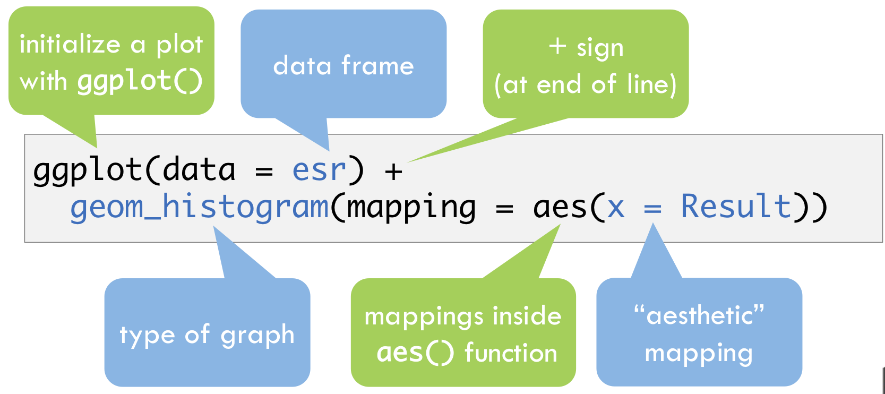

```{r setup_6, include=FALSE}
knitr::opts_chunk$set(echo = TRUE)
library(tidyverse)
library(janitor)
```

## Plotting Data With Default Graphics: A Quick Refresher

Default R comes with several basic plotting commands -- `plot` to draw an X,Y graph, `points` to add X,Y points to the current graph, `barplot` to draw vertical or horizontal bars, `boxplot` to draw box-and-whisker plots, `hist` to build and draw a histogram, and many other plot types or plot-specific additions to plots.

The first major drawback to using these plots is that each requires learning a slightly different syntax to decorate the graph. For example, here are three plots based on the January sample data, showing the ion ratios for all compounds and samples which exhibit and quant and qual peak. The first is a simple series plot, changing the default plot color to blue.

```{r}
january_samples <- read_csv("data/2017-01-06_s.csv") %>%
  clean_names()
january_samples$idx <- c(1:nrow(january_samples))
has_ion_ratio <- january_samples$ion_ratio > 0
plot(january_samples$ion_ratio[which(has_ion_ratio)], col='blue')
```

If you want a histogram instead of a sequential series, the function changes but based on how `plot` looked, the coloring results may not be what you expected.

```{r}
hist(january_samples$ion_ratio[which(has_ion_ratio)], col='blue')
```

In order to plot the histogram with blue outline, to match the blue open circles of the first plot, you need to specify a different variable.

```{r}
hist(january_samples$ion_ratio[which(has_ion_ratio)], border='blue', main='Histogram')
```

The second drawback is that these plots, while drawn quickly, require detailed sort and select mechanisms in order to display complex data on a single graph. Plotting a matrix of graphs (as shown below) is even more difficult and you may spend more time troubleshooting the graph than actually analyzing the data. Here is a simple example which colors the series data by compound. 

```{r}
compounds <- unique(january_samples$compound_name)
for (i in 1:length(compounds)) {
  if (i == 1) {
    plot(
      january_samples$ion_ratio[has_ion_ratio & january_samples$compound_name == compounds[i]],
      col = i,
      main = "color by compound"
    )
  } else {
    points(
      january_samples$ion_ratio[has_ion_ratio & january_samples$compound_name == compounds[i]],
      col = i
    )
  }
}
```

In summary the base plotting functions can be helpful for generating quick plots of simple data, but for more advanced functionality, using the ggplot2 package is recommended.

## Plotting Data With ggplot2

The ggplot2 package has many advantages to base plotting functions: 
- it keeps the same syntax for all graphing schemes
- it has arguably prettier default graphs
- it has an intuitive syntax for layering/faceting of the underlying data
- it is built to efficiently plot tidy data (one observation per row)

The main drawback is that plotting from a large data frame may take longer than base functions. The mock data in this course definitely qualifies as a large dataset, so we recommend that plotting be used judiciously if you're not applying a filter (see below).

The syntax follows the format of {'define the data' + 'describe the visualization'} where each description is called a *geom* and multiple geoms can be stacked together. Definitions for the aesthetic mappings (e.g. plotTerms, color, iconShape, lineType) can be supplied when defining the data and are applied to the subsequent stack of geoms. Any mappings can be overridden within an individual geom.



Let's start with a simple histogram of the ion ratios present in the data set. First filter the samples to include only those with ion ratios greater than 0. We are only plotting one field and using a histogram geom.

```{r}
january_pos_ir <- january_samples %>%
  filter(ion_ratio > 0)
ggplot(january_pos_ir) + geom_histogram(mapping = aes(x = ion_ratio))
```

Note that the default behavior is the break up the distribution into 30 bins. We can supply an additional argument to the histogram geom to explicitly define the binwidth:

```{r}
ggplot(january_pos_ir) + geom_histogram(mapping = aes(x = ion_ratio), binwidth = 0.01)
```

Now let's add another variable and look at a different view of the data: a plot of ion ratio by row number in the data set, using the sample data set that has been filtered to include only samples with ion ratio greater than 0. We will specify that mapping of sample id on the x-axis, ion ratio on the y-axis, and a point geom to render the data points as points on the graph.

```{r}
ggplot(data = january_pos_ir) + geom_point(mapping = aes(x = idx, y = ion_ratio))
```

If we want to add additional variables to the plot, we can add additional information to the mapping. In this case we may want to visualize different compounds.

```{r}
ggplot(data = january_pos_ir) + geom_point(mapping = aes(x = idx, y = ion_ratio, col = compound_name))
```

This is interesting but doesn't provide as clear a look of the data. It would be better to visualize each compound on its own plot, which we can accomplish easily using a facet function. Notice that defining the data can be done as a variable (here it is `g`) and that definition can be used later for any number of geoms.

```{r}
g <- ggplot(data = january_pos_ir) + 
  geom_point(mapping = aes(x = idx, y = ion_ratio, col = compound_name))
g + facet_wrap(~compound_name)
```

We can add additional "layers" that control the appearance of the visualization. For example, we may actually care about the row numbers in our plot, so we add an argument to modify the x-axis label.

```{r}
g + 
  facet_wrap(~compound_name) + 
  scale_x_continuous(labels = NULL)
```

We can also change the labels of the variables in the axes and legend using `xlab`, `ylab`, and `scale_color_discrete`. The functions used to rename the legend can be confusing: keep in mind that there is a different scale function for the legend based on the aesthetic you are modifying. In our case the compound name determines the color so we use `scale_color_discrete` to change the legend. If we changed the fill of a plot, we would use the `scale_fill_discrete` function.

```{r}
g + 
  facet_wrap(~compound_name) + 
  scale_x_continuous(labels = NULL) +
  xlab("Sample ID") +
  ylab("Ion Ratio") +
  scale_color_discrete(name = "Compound")
```

Faceting can be applied effectively in a variety of settings: for example, we can apply `facet_wrap` to the previous histogram in a similar way.

```{r}
ggplot(data = january_pos_ir) + 
  geom_histogram(mapping = aes(x = ion_ratio), binwidth = 0.01) +
  facet_wrap(~compound_name)
```

Another handy capability of ggplot is adding multiple layers to a plot. Let's revisit our original data set and filter to include only the samples of known concentration (standards and QC samples). We can plot the observed concentration against the expected concentration and differentiate the compounds by color.

```{r}
known_samples <- january_samples %>%
  filter(sample_type != "unknown")
ggplot(data = known_samples) + 
  geom_point(mapping = aes(x = expected_concentration, y = concentration, col = compound_name))
```

There is a lot of overlap, so let's modify the poisition of the points to prevent overlap using the position argument to the point geom:

```{r}
ggplot(data = known_samples) + 
  geom_point(mapping = aes(x = expected_concentration, y = concentration, col = compound_name), position = position_dodge(width = 25))
```

Instead of observing the data points, we may be only interested in a line that is fit to the data points, which we can generate quickly using the smooth geom.

```{r}
ggplot(data = known_samples) + geom_smooth(mapping = aes(x = expected_concentration, y = concentration, col = compound_name))
```

Not a whole lot of excitement here: the observed concentrations are highly correlated with expected concentrations.

We may want to see both the original data points and a line fit to them. Up until now, we have been including the mapping argument within the geom function. However, we may not want to duplicate the same code if the mapping is identical for multiple geoms. Instead we can place the mapping arguments in the `ggplot` function and add multiple layers without calling the mapping every time.

```{r}
ggplot(data = known_samples, mapping = aes(x = expected_concentration, y = concentration, col = compound_name)) + 
  geom_smooth() +
  geom_point(position = position_dodge(width = 25))
```

Ultimately plotting the raw data points may not be the best visualization. Plotting boxplots may be best. The trick here is that the boxplot expects one of the arguments to be a discrete/categorical variable rather than a continuous one. By converting expected concentration to a factor, we can plot distributions at each of the expected concentrations.

```{r}
ggplot(data = known_samples) + 
  geom_boxplot(mapping = aes(x = factor(expected_concentration), y = concentration, col = compound_name))
```

**Exercise**  

The default histogram paramaters for ggplot will stack the sample types in the same bin, making it difficult to determine if the trend for qc and standard samples is the same as the unknowns. Starting with the data that only includes samples with non-zero ion ratios, create a plot that compares ion ratio between different sample types and compounds. Because the number of samples with different sample types is quite disparate, oberving trends may be challenging with raw counts: look at the hint below to plot the density of the distribution rather than raw counts.

```{r, echo = FALSE, eval = FALSE}
g <- ggplot(data = , aes(x = , color = , fill = ))
g + geom_histogram(aes(y = ..density..), bins = ) +
  
```

```{r}
g <- ggplot(data = january_pos_ir, aes(x = ion_ratio, colour = sample_type, fill = sample_type))
# g + geom_histogram(binwidth = 0.01) + facet_grid(sample_type~compound_name)
g + geom_histogram(aes(y=..density..), binwidth = 0.01) + facet_grid(sample_type~compound_name)
```

**End Exercise**

## Summary
- Plotting with ggplot has a unique but consistent syntax
  - Data set is defined first (similar to other tidyverse functions)
  - Aesthetics map variables to plot characteristics, like axes or colors
  - Geoms are geometric objects representing data
  - Facets can be helpful to separate plots by one or two variables
- The [ggplot2 cheatsheat](https://www.rstudio.com/wp-content/uploads/2015/03/ggplot2-cheatsheet.pdf) is a valuable quick reference to help identify the best plot
