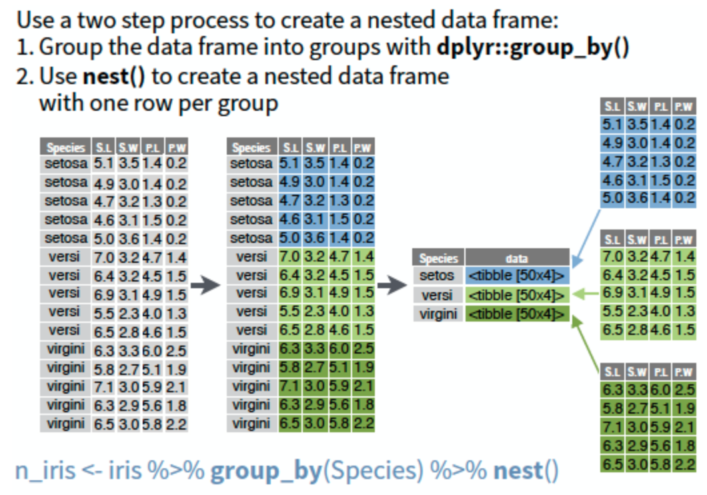

```{r setup_8, include=FALSE}
knitr::opts_chunk$set(echo = TRUE)
library(tidyverse)
library(readxl)
library(janitor)
library(lubridate)
```

## Overview of lesson activities

In this lesson we will gain more experience with some of the tools we have discussed throughout this course and ask you to dive into a new data set to answer a variety of questions. For many of the questions we will ask, there is no right or wrong way to answer the question. However, this is an opportunity to use new functions you have learned so far in this course. Our answers to the questions will primarily use tidyverse functions, but regardless of how you answer questions, you are looking for output of code to be the same.

## Introduction to data set

The data set for this lesson is derived from orders for clinical laboratory tests in an electronic health record system in a set of outpatient clinics. The orders were deidentified and time-shifted (and approved for use as a teaching resource). There are two files:
- "orders_data_set.xlsx" represents the data as one row per order and includes the bulk of the details
- "order_details.csv" maintains the one row per order structure and include ancillary information about how a test was ordered

There are some column pairs with very similar names: one variable is a code ("_C") and the other is a description ("_C_DESCR"). This is largely done for covenience in querying the data or subsetting it without typing long strings. Because some may not be familiar with this type of data, we include a small data dictionary below to explain some of the data.

Variable                Description
---------               ---------------
Order ID                Key for order
Patient ID              Key for patient
Description             Text description of lab test
Proc Code               Procedure code for lab test
ORDER_CLASS_C_DESCR     Setting test is intended to be performed in (eg. Normal = regular blood draw)
LAB_STATUS_C            Status of laboratory result
ORDER_STATUS_C          Status of order
REASON_FOR_CANC_C       Cancellation reason (if applicable)
Order Time              Timestamp for time of original test order
Result Time             Timestamp for more recent result in the record
Review Time             Timestamp for provider acknowledgment of review of result
Department              Clinic associated with test order
ordering_route          Structure/menu in health record from which order was placed
pref_list_type          Category of preference list (if applicable)

## Data import and preparation

We have a data set that is spread out over a couple files, with varying formats for variable names, and we want to consider what data types would be most appropriate for each of our variables. The overall goal of our analysis is to understand the metadata associated with this set of orders and identify any trends that would be useful in making changes to the electronic ordering and lab or clinic workflows. At this point it might be a little abstract because we are exploring the data but we know a few things we can address up front:
- there are two files whose data could probably live in one data frame
- the column names in the file have variable formatting
- there are timestamps for which we may want to provide trends over time

**Exercise 1**

Let's work on addressing the above issues.

1. Import the data from each file
1. Clean variable names
1. Assess the relationship between the data in both files. Evaluate whether there is a one-to-one mapping, a many-to-one mapping, etc. (Hint: doing some exploration with various join functions can help answers quickly - [helpful reference](http://stat545.com/bit001_dplyr-cheatsheet.html))
1. Consider which variables you may want to represent as factors (eg. for quick visual summaries) and convert
1. Assess the time span for orders and consider if there are specific time periods over which you may want to aggregate orders to view trends (eg. daily, weekly, monthly, yearly). Add additional variables to parse out these date components (and save yourself some work in the future). Refer to lesson 4 and [lubridate documentation](https://cran.r-project.org/web/packages/lubridate/vignettes/lubridate.html).
1. Summarize the data

```{r, echo = FALSE, eval = FALSE}
orders_raw <-
order_details <-

orders <- orders_joined %>%

summary(orders)
```

```{r}
orders_raw <- read_excel("data/orders_data_set.xlsx") %>%
  clean_names()
order_details <- read_csv("data/order_details.csv") %>%
  clean_names()
# relationship is one-to-one so inner_join/left_join/right_join all work
orders_joined <- orders_raw %>%
  left_join(order_details, by = "order_id")
# may be some variation in which fields you choose to turn into factors
# numeric codes could be factors too
orders <- orders_joined %>%
  mutate(description = as.factor(description),
         proc_code = as.factor(proc_code),
         order_class_c_descr = as.factor(order_class_c_descr),
         lab_status_c_descr = as.factor(lab_status_c_descr),
         order_status_c_descr = as.factor(order_status_c_descr),
         reason_for_canc_c_descr = as.factor(reason_for_canc_c_descr),
         department = as.factor(department),
         ordering_route = as.factor(ordering_route),
         pref_list_type = as.factor(pref_list_type)) %>%
  mutate(order_month = month(order_time),
         order_week = week(order_time))
summary(orders)
```

**End Exercise**

## Exploration of data

Let's take a high level look at the data, with some areas to explore:

- Overall orders over time - are there any dramatic changes in volume over the time period?
- Which tests are most commonly ordered?
- What is the overall cancellation rate and has it changed over time?

General hint for upcoming exercises: review documentation on [janitor package](http://sfirke.github.io/janitor/articles/janitor.html) and/or [table function](https://www.rdocumentation.org/packages/base/versions/3.5.1/topics/table).

**Exercise 2**

1. Plot the order volume over the duration of the data set, at the level of day and week. (Keep in mind how ggplot parses time some geoms - it may be based on seconds.)

```{r, echo = FALSE, eval = FALSE}

```

```{r}
ggplot(data = orders) + 
  geom_histogram(mapping = aes(x = order_time), binwidth = 60*60*24)
ggplot(data = orders) + 
  geom_histogram(mapping = aes(x = order_time), binwidth = 60*60*24*7)
```

2. Plot or tabulate the breakdown of test orders in the data set (using description or procedure code). Use the `slice_head()` function to restrict the output to the top 25 most commonly ordered tests. (Review the help documentation for `slice()` and related functions.)

```{r, echo = FALSE, eval = FALSE}

```

```{r}
orders %>%
  tabyl(description) %>%
  arrange(desc(n)) %>%
  slice_head(n = 25)
```

3. Plot and/or tabulate cancellations over time for the data set.

```{r, echo = FALSE, eval = FALSE}

```

```{r}
ggplot(data = orders) + 
  geom_histogram(mapping = aes(x = order_time, fill = order_status_c_descr), binwidth = 60*60*24*7)
orders %>%
  tabyl(order_status_c_descr, order_week) %>%
  adorn_totals("row") %>% # tabulate operations below across rows
  adorn_percentages("row") %>% # express counts as percentages
  adorn_pct_formatting() %>% # clean up percentages for nicer printing
  adorn_ns() # add back in counts (N's)
```

4. Explore whether there are specific tests that are cancelled more frequently than others. Restrict the output to the top 25 tests.

```{r, echo = FALSE, eval = FALSE}

```

```{r}
orders %>%
  #filter(description %in% orders_top25$description) %>%
  tabyl(description, order_status_c_descr) %>%
  arrange(desc(Completed)) %>%
  #top_n(25, Completed) %>%
  adorn_totals("row") %>% # tabulate operations below across rows
  adorn_percentages("row") %>% # express counts as percentages
  adorn_pct_formatting() %>% # clean up percentages for nicer printing
  adorn_ns()  %>%# add back in counts (N's)
  slice_head(n = 25)
```

**End Exercise**

## Answering clinic-specific questions 

Based on some preliminary analysis and past knowledge, we want to dig into clinic-specific practices for ordering tests. 

**Exercise 3**

The following is a list of questions regarding clinic-specific characteristics of orders that we would like to answer:

- Which clinics order the highest volume of tests?
- Which clinics have the highest numbers and rates of test cancellation?
- Are there any clinics collecting blood at the clinic as opposed to at blood draw?
- Which clinics are using SmarSets (order sets) most extensively?
- Which clinics continue to use Provider Preference Lists, which are discouraged?

```{r, echo = FALSE, eval = FALSE}

```

Clinics ordering the highest volume of tests:
```{r}
orders %>% 
  tabyl(department) %>%
  arrange(desc(n))
```

Clinics with the highest numbers and rates of cancels:
```{r}
orders %>% 
  tabyl(department, order_status_c_descr) %>%
  arrange(desc(Completed)) %>%
  adorn_totals("row") %>% 
  adorn_percentages("row") %>% 
  adorn_pct_formatting() %>% 
  adorn_ns() 
```

Rates of clinic collections:
```{r}
orders %>% 
  tabyl(department, order_class_c_descr) %>%
  arrange(desc(`Clinic Collect`)) %>%
  adorn_totals("row") %>% 
  adorn_percentages("row") %>% 
  adorn_pct_formatting() %>% 
  adorn_ns() 
```

Rate of SmartSet usage:
```{r}
orders %>% 
  tabyl(department, ordering_route) %>%
  arrange(desc(`SmartSet`)) %>%
  adorn_totals("row") %>%
  adorn_percentages("row") %>%
  adorn_pct_formatting() %>% 
  adorn_ns() %>%
  select(department, SmartSet)
```

Rates of Provider Preference List Usage:
```{r}
orders %>% 
  tabyl(department, pref_list_type) %>%
  arrange(desc(`Provider Preference List`)) %>%
  adorn_totals("row") %>%
  adorn_percentages("row") %>%
  adorn_pct_formatting() %>% 
  adorn_ns()
```

**End Exercise**

## Evaluating turnaround times for result review

Unfortunately this data set is missing crucial timestamps needed to assess lab turnaround times. Assessing the time between order and result might be interesting, but there are various workflow variations that make this difficult to interpret. What is more straightforward to interpret, however, is the duration between when a test is resulted and when that result is reviewed by the repsonsible provider. We do not have provider identifiers in this data set, but we can still assess the result-to-review turnaround time by clinic.

**Exercise 4**

Develop a visualization that shows the distribution of different result-to-review intervals, separated by clinic.

```{r, echo = FALSE, eval = FALSE}

```

```{r}
orders <- orders %>%
  mutate(rr_interval = as.numeric(difftime(review_time, result_time, units = "days")))
ggplot(orders, aes(x = department, y = rr_interval)) +
  geom_boxplot() +
  coord_flip()
```

**End Exercise**


## Using nested data frames to scale analyses

The orders data set is a good one to introduce the concepts of nested data frames and list-columns. These features in R help with automating analyses and keeping outputs together.   

A nested data frame is one that includes a list-column of data frames. In this format, each row is a meta-observation, meaning the data are held in columns that define the observation and one or more list-columns of data frames that hold the individual data components. This may be easier to understand by comparing our orders data set in a nested and unnested format.  

The orders data set has 45002 rows of 20 variables. So far, we've been exploring the data set as a whole. However, we've seen that there are differences among some facets of the data, such as department. It may be useful then to group the data by department and perform the same analyses for each department. This can be done by copying and pasting code and substituting department name for each of the 20 departments. This may be manageable for small numbers of groups, BUT, this is the 201 R class, so we're going to learn how to use R to automate this type of work, so you can scale such analyses easily. We'll see how data in nested or list-column format combined with the map functions we learned about earlier is well designed for this.   

The syntax is relatively straightforward and similar to what we've seen previously when we grouped by variables and summarized. We first group our data by a selected variable or variables and pass this grouped data frame to `nest()`. Let's see what this nested data frame looks like.  


```{r}
orders_nest <- orders %>%
                group_by(department) %>%
                nest()
```

You should see two columns. One for the department and the second is a list-column that contains all the data for this department. Since there are 20 unique departments, there are 20 rows in the nested data frame. 

```{r, echo = FALSE}

```

We can access individual components from our nested data frame using [[]] or $ selector notation. 

```{r}
orders_nest$data # all 20 data frames in the data column

orders_nest[[2]][[1]] # data frame for first location
orders_nest$data[[1]] # data frame for the first location
```

To go back to a flat data frame, we use `unnest()` and specify which column we want to unnest, in this case it is the data column.  


```{r}
orders_unnested <- orders_nest %>% unnest(data) # looks just like orders
```


Back to our nested data frame, we now have data separated in a way that makes it easy to apply the same analysis across the data for all departments individually. Similar to previous lessons using `summarize()` and the different `map()` functions, we need a function to apply to our data. In the previous cases, we used existing functions in R: `mean()`, `read_excel()`. Here, we will review how to create our own function and map this across our list-column.  

We saw above that there are differences in use of the discouraged provider preference lists. If we want to know how these vary by department, in more detail, we can create a table similar to those above, but for each department. 

This table shows the top 10 orders most frequently ordered from a provider preference list by department and calculates the percent usage of the provider preference list for each test.

```{r}
orders %>% 
  filter(department == "ENDOCRINOLOGY CLINIC") %>%
  tabyl(description, pref_list_type) %>%
  arrange(desc(`Provider Preference List`)) %>%
  slice_head(n = 10) %>%
  adorn_totals("row") %>%
  adorn_percentages("row") %>%
  adorn_pct_formatting() 
```


Great - so, we could iterate over all 20 departments manually by changing the department in the `filter()` call -- or we can automate this process. First we will build a function that creates this table for whatever dataset is supplied to it. We make small modifications to the code above to create our function:

1. We need to identify that we are writing a function - use `function(){}`    
2. Within the () supply the name for a data argument, in this case df, as we will be passing a data frame to our function.  
3. Within the {} we write the code we want carried out. This should be the code from above with a change to the input data. Since we will be iterating over our list column that is specific to a department, we don't need the filter step.  
4. We execute the entire code chunk to save our new function to our environment.  

```{r}
pro_pref_sum <- function(df) {
  df %>%
  tabyl(description, pref_list_type) %>%
    arrange(desc(`Provider Preference List`)) %>%
    slice_head(n = 10) %>%
    adorn_totals("row") %>%
    adorn_percentages("row") %>%
    adorn_pct_formatting() 
}
```

Now we have our user defined function ready. We can test that it performs as expected by trying one data for of the departments.  

```{r}
pro_pref_sum(orders_nest$data[[2]]) # look at endocrinology
```


We will use `map()` to apply our function to each of our data frames in the data list column, generating a table for each department.   

Remember the syntax is: map(.x, .f). We'll create a new column to hold the data for our summary tables.  

```{r}
orders_nest <- orders_nest %>%
              mutate(pro_pref = map(data, pro_pref_sum))
```

Our data are now stored with the analyses. Hopefully you can imagine the power of this skill and the ability to easily apply functions (built-in or user-defined) across features of a data set. 


**Exercise 5**
Let's do an exercise to create a plot for each department to show the distribution of the result review times. 

Write a function that creates a density plot for the review TAT and apply it to the data for each department. Add the plots as a new column in your nested data set.  

```{r, echo = FALSE, eval = FALSE}


```


```{r}
plots <- function(df) {
  df %>%
    ggplot(aes(rr_interval)) +
    geom_density() +
    labs(x = "Time to Result Review (days)")
}

orders_nest <- orders_nest %>%
          mutate(plots = map(data, plots))
```

**End Exercise**
