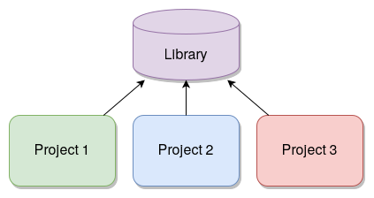

```{r setup, include=FALSE}
knitr::opts_chunk$set(echo = FALSE)
library(here)
library(tidyverse)
```

## What is reproducible research?

Reproducible research = any research result can be reproduced by anybody

Reproducibility can be achieved when the following criteria are met [(Marecelino 2016)](https://www.r-bloggers.com/what-is-reproducible-research/):

- All methods are fully reported
- All data and files used for the analysis are available
- The process of analyzing raw data is well reported and preserved

## Why should I care about reproducibility?

- Someone else may need to run your analysis
- You will want to run the same exact analysis or a very similar analysis in the future
- You may want to improve on that analysis

**"Everything you do, you will probably have to do over again."** [(Noble 2009)](http://journals.plos.org/ploscompbiol/article?id=10.1371/journal.pcbi.1000424)

## Reproducbility practices discussed in this course

- Adopt a style convention for coding
- Develop a standardized but easy-to-use project structure
- Enforce reproducibility when working with projects and packages
- Use a version control system

Great resource: "Good enough practices in scientific computing" [(Wilson 2017)](http://journals.plos.org/ploscompbiol/article?id=10.1371/journal.pcbi.1005510)

## Adopt a style convention for coding

- Consistent style makes it easier for others (and yourself to read code)
- Tidyverse style guide: http://style.tidyverse.org/

## Adopt a style convention for coding

- Highlights:

  -Use underscores to separate words in a name (see above comments for file names)
  - Put a space before and after operators (such as `==`, `+`, `<-`), but there are a few exceptions such as `^` or `:`
  - Use `<-` rather than `=` for assignment
  - Try to limit code to 80 characters per line
  - If a function call is too long, separate arguments to use one line each for function, arguements, and closing parenthesis

## Style convention example

```{r, echo = TRUE, eval = FALSE}
# Good
do_something_very_complicated(
  something = "that",
  requires = many,
  arguments = "some of which may be long"
)

# Bad
do_something_very_complicated("that", requires, many, arguments,
                              "some of which may be long"
                              )
```

## Packages supporting consistent coding style

- [styler](http://styler.r-lib.org/) is a package that
allows you to interactively reformat a chunk of code, a file, or a
directory
  - styler can function as an Addin within RStudio (look above your markdown window for addins already installed in your RStudio)
  - You can highlight code, apply styler via the Addins menu, and code will automatically be formatted per the Tidyverse style guid
- [formatr](https://yihui.org/formatr/) allows you to reformat whole files and directories
- [lintr](https://github.com/jimhester/lintr) checks code and provides output on formatting issues

## Representing sequential operations in R - pipes

```{r, echo = TRUE, eval = FALSE}
# one way to represent a hop, scoop, and a bop, without pipes
my_morning <- wake_up(I, time = "8:00")
my_morning <- get_out_of_bed(my_morning, side = "correct")
my_morning <- get_dressed(my_morning, pants = TRUE, shirt = TRUE)
my_morning <- leave_house(my_morning, car = TRUE, bike = FALSE)
```

## Same example using pipes

```{r, echo = TRUE, eval = FALSE}
my_morning <- I %>%
  wake_up(time = "8:00") %>%
  get_out_of_bed(side = "correct") %>%
  get_dressed(pants = TRUE, shirt = TRUE) %>%
  leave_house(car = TRUE, bike = FALSE)
```

## Develop a standard project structure

- **Put each project in its own directory, which is named after the project**
- Put text documents associated with the project in the doc directory
- **Put raw data and metadata in a data directory and files generated during cleanup and analysis in a results directory**
- Put project source code in the src directory
- Put compiled programs in the bin directory
- **Name all files to reflect their content or function**

## Exercise 1

1.  Navigate to "Global Options" under the Tools menu in the RStudio
    application and note the *Default working directory (when not in a
    project)*
2.  Navigate to your Console and get the working directory using
    `getwd()`
3.  If you haven't already installed the fs package (from the pre-course
    instructions), do so now: `install.packages("fs")`. Then load the
    package with `library(fs)` if you did not already run the set up
    chunk above.
4.  Review the contents of your current folder using `dir_ls()`. (Base
    equivalent: `list.files()`)
5.  Now try to set your working directory using `setwd("test_dir")`.
    What happened?
6.  Create a new test directory using `dir_create("test_dir")`. (Base
    equivalent: `dir.create("test_dir")`)
7.  Review your current directory
8.  Set your directory to the test directory you just created
9.  Using the Files window (bottom right in RStudio, click on **Files**
    tab if on another tab), navigate to the test directory you just
    created and list the files. *Pro tip: The More menu here has
    shortcuts to set the currently displayed directory as your working
    directory and to navigate to the current working directory*
10. Navigate back to one level above the directory you created using
    `setwd("..")` and list the files
11. Delete the directory you created using the `dir_delete()` function.
    Learn more about how to use the function by reviewing the
    documentation: `?dir_delete`. (Base equivalent: `unlink()` +
    additional arguments)
    
## fs package: `dir_ls` to list files in a directory

```{r, echo = TRUE, eval = FALSE}
library(fs)
dir_ls("data")
```

```{r, echo = FALSE}
library(fs)
dir_ls(here("data")) %>% head()
```

## Find files with a specific extension or pattern

```{r, echo = TRUE, eval = FALSE}
dir_ls(path = "data", glob = "*_s.csv")
```

```{r, echo = FALSE}
dir_ls(here("data"), glob = "*_s.csv") %>% head()
```

## Create directory with `dir_create`

- Optional exercise: create a projects directory

```{r, echo = TRUE, eval = FALSE}
dir_create("Projects")
setwd("/Projects")
```

## Exercise 2

1.  Navigate to the **File** menu and select **New Project...** OR
    Select the **Create a project** button on the global toolbar (2nd
    from the left)
2.  Select **New Directory** option
3.  In the Project Type prompt, select **New Project**
4.  In the Directory Name prompt under Create New Project, enter
    "msacl-201-project"
5.  In the Create Project as a Subdirectory of prompt under Create New
    Project, navigate to the Projects folder you just created (or
    another directory of your choosing). You can type in the path or hit
    the **Browse** button to find the directory. Check the option for
    "Open in a new session" and create your project.

## Exercise 2 Comments

- RStudio projects can be easily closed and re-opened, preserving your work at a given time
- RStudio projects can also help with directory organization
  - Working dir = project dir (unless otherwise explicitly specified)
  
## Create a data directory and a results directory

- Using programming languages (as opposed to Excel) can help separate analysis from data
  - Cannot trace what happened to data if overwritten during analysis
- Raw data in **data** directory
- Results from analysis in **results** or **output** directory
- May want to separate out source code (**src** directory), figures, and documents (eg. manuscripts) as well

## Exericse 3

Create a minimal project structure

```{r, echo = TRUE, eval = FALSE}
library(fs)
dir_create("data") # raw data
dir_create("output") # output from analysis
dir_create("cache") # intermediate data (after processing raw data)
dir_create("src") # code goes into this folder
```

## Exercise 3 Comments

- Can convert code into a function that will build project structure for you [Refresher on writing functions](https://swcarpentry.github.io/r-novice-inflammation/02-func-R/)
- Alternately, use an existing package to create your project structure: eg. [Project Template](http://projecttemplate.net/index.html)


## Name all files (and variables) to reflect their content or function

- Compare the following names:
  - results.csv
  - morphine_precision_results.csv
- Avoid sequential numerical names: what happens to figure2.jpg and figure3.jpg if you need to insert a figure between them in the manuscript?
- **Pro tip: avoid white space and camel case (upper and lower case) in names**
  - More efficient to type all lower case
  - Ambiguity about whether you used white space or not
  

## Reproducibility of directory structure

Scenario:

- you have an analysis to share with a colleague
- want to share entire project folder
- directory calls specific files
- you use `setwd()` to put yourself in the right place to call scripts

Problem:

Your working directory name is almost never the same as someone else's!

## The here package

- Function in [here package](https://cran.r-project.org/web/packages/here/index.html) anchors you in one directory
- Call `library(here)` in script
- Follows algorithm to find the right place:
  - Looks for .Rproj and uses that directory as reference
  - Looks for empty ".here" file (can create this using `set_here()`)
  - Looks for other relevant files such as ".git"
  
## Reproducibility of packages

Scenario:

- in September 2019 you want to run an analysis you wrote in September 2018
- you are using cutting edge packages that may have changed in 1 year
- some changes impact expected input and output data structure

Problem:
Your script may fail to run or (much worse) your script runs but produces incorrect output!

## System packages are shared between different projects



## Package management solutions link projects to specific packages


## Package management solutions - checkpoint

- [checkpoint package](https://cran.r-project.org/web/packages/checkpoint/vignettes/checkpoint.html) couples package install to a date
  - Based on Microsoft server that is taking daily snapshots of CRAN
  - Add `library(checkpoint)` and `checkpoint("2018-09-09")` to begining of script

## Package management solutions - renv

- [renv](https://rstudio.github.io/renv/articles/renv.html) maintains specification of package versions
  - More complex to manage but arguably the "ideal" way to manage packages
  - Use `renv::init()` to capture the state of your R libraries and create local project library
  - RStudio integration with Packages window
  
## Lesson 1 wrap-up

* Reproducible research is the principle that any research result can be reproduced by anybody
* Practices in reproducible research also offer benefits for to the code author in producing clearer, easier to understand code and being able to easily repeat past work

## Lesson 1 wrap-up

* Important practices in reproducible research include:
  - Developing a standardized but easy-to-use project structure
  - Adopting a style convention for coding
  - Enforcing reproducibility when working with projects and packages
