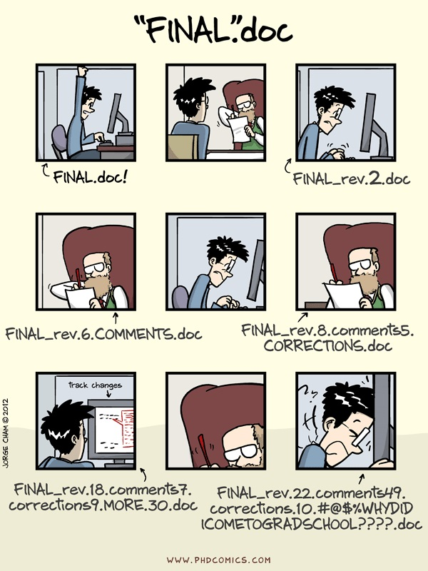

```{r setup, include=FALSE}
knitr::opts_chunk$set(echo = FALSE)
library(here)
library(tidyverse)
```

## What is reproducible research?

Reproducible research = any research result can be reproduced by anybody

Reproducibility can be achieved when the following criteria are met [(Marecelino 2016)](https://www.r-bloggers.com/what-is-reproducible-research/):

- All methods are fully reported
- All data and files used for the analysis are available
- The process of analyzing raw data is well reported and preserved

## Why should I care about reproducibility?

- Someone else may need to run your analysis
- You will want to run the same exact analysis or a very similar analysis in the future
- You may want to improve on that analysis

**"Everything you do, you will probably have to do over again."** [(Noble 2009)](http://journals.plos.org/ploscompbiol/article?id=10.1371/journal.pcbi.1000424)

## Reproducbility practices discussed in this course

- Develop a standardized but easy-to-use project structure
- Adopt a style convention for coding
- Enforce reproducibility when working with projects and packages
- Use a version control system

Great resource: "Good enough practices in scientific computing" [(Wilson 2017)](http://journals.plos.org/ploscompbiol/article?id=10.1371/journal.pcbi.1005510)

## Develop a standard project structure

- **Put each project in its own directory, which is named after the project**
- Put text documents associated with the project in the doc directory
- **Put raw data and metadata in a data directory and files generated during cleanup and analysis in a results directory**
- Put project source code in the src directory
- Put compiled programs in the bin directory
- **Name all files to reflect their content or function**

## Exercise 1

Navigate your directory structure

## fs package: `dir_ls` to list files in a directory

```{r, echo = TRUE, eval = FALSE}
library(fs)
dir_ls("data")
```

```{r, echo = FALSE}
library(fs)
dir_ls(here("data")) %>% head()
```

## Find files with a specific extension or pattern

```{r, echo = TRUE, eval = FALSE}
dir_ls(path = "data", glob = "*_s.csv")
```

```{r, echo = FALSE}
dir_ls(here("data"), glob = "*_s.csv") %>% head()
```

## Create directory with `dir_create`

- Optional exercise: create a projects directory

```{r, echo = TRUE, eval = FALSE}
dir_create("Projects")
setwd("/Projects")
```

## Exercise 2

Create a new project using RStudio functionality

## Exercise 2 Comments

- RStudio projects can be easily closed and re-opened, preserving your work at a given time
- RStudio projects can also help with directory organization
  - Working dir = project dir (unless otherwise explicitly specified)
  
## Create a data directory and a results directory

- Using programming languages (as opposed to Excel) can help separate analysis from data
  - Cannot trace what happened to data if overwritten during analysis
- Raw data in **data** directory
- Results from analysis in **results** or **output** directory
- May want to separate out source code (**src** directory), figures, and documents (eg. manuscripts) as well

## Exericse 3

Create a minimal project structure

## Exercise 3 Comments

- Can convert code into a function that will build project structure for you [Refresher on writing functions](https://swcarpentry.github.io/r-novice-inflammation/02-func-R/)
- Alternately, use an existing package to create your project structure: eg. [Project Template](http://projecttemplate.net/index.html)


## Name all files (and variables) to reflect their content or function

- Compare the following names:
  - results.csv
  - morphine_precision_results.csv
- Avoid sequential numerical names: what happens to figure2.jpg and figure3.jpg if you need to insert a figure between them in the manuscript?
- **Pro tip: avoid white space and camel case (upper and lower case) in names**
  - More efficient to type all lower case
  - Ambiguity about whether you used white space or not
  
## Adopt a style convention for coding

- Consistent style makes it easier for others (and yourself to read code)
- Tidyverse style guide: http://style.tidyverse.org/
- styler and lintr packages can style a code chunk or document for you

## Adopt a style convention for coding

- Highlights:

  -Use underscores to separate words in a name (see above comments for file names)
  - Put a space before and after operators (such as `==`, `+`, `<-`), but there are a few exceptions such as `^` or `:`
  - Use `<-` rather than `=` for assignment
  - Try to limit code to 80 characters per line
  - If a function call is too long, separate arguments to use one line each for function, arguements, and closing parenthesis

## Style convention example

```{r, echo = TRUE, eval = FALSE}
# Good
do_something_very_complicated(
  something = "that",
  requires = many,
  arguments = "some of which may be long"
)

# Bad
do_something_very_complicated("that", requires, many, arguments,
                              "some of which may be long"
                              )
```

## Representing sequential operations in R - pipes

```{r, echo = TRUE, eval = FALSE}
# one way to represent a hop, scoop, and a bop, without pipes
foo_foo <- hop(foo_foo, through = forest)
foo_foo <- scoop(foo_foo, up = field_mice)
foo_foo <- bop(foo_foo, on = head)
# another way to represent the same sequence with less code but in a less readable way
foo_foo <- bop(scoop(hop(foo_foo, through = forest), up = field_mice), on = head)
```

## Same example using pipes

```{r, echo = TRUE, eval = FALSE}
foo_foo %>%
  hop(through = forest) %>%
  scoop(up = field_mouse) %>%
  bop(on = head)
```

## Reproducibility of directory structure

Scenario:

- you have an analysis to share with a colleague
- want to share entire project folder
- directory calls specific files
- you use `setwd()` to put yourself in the right place to call scripts

Problem:

Your working directory name is almost never the same as someone else's!

## The here package

- Function in [here package](https://cran.r-project.org/web/packages/here/index.html) anchors you in one directory
- Call `library(here)` in script
- Follows algorithm to find the right place:
  - Looks for .Rproj and uses that directory as reference
  - Looks for empty ".here" file (can create this using `set_here()`)
  - Looks for other relevant files such as ".git"
  
## Reproducibility of packages

Scenario:

- in September 2019 you want to run an analysis you wrote in September 2018
- you are using cutting edge packages that may have changed in 1 year
- some changes impact expected input and output data structure

Problem:
Your script may fail to run or (much worse) your script runs but produces incorrect output!

## Package management solutions

- [checkpoint package](https://cran.r-project.org/web/packages/checkpoint/vignettes/checkpoint.html) couples package install to a date
  - Based on Microsoft server that is taking daily snapshots of CRAN
  - Add `library(checkpoint)` and `checkpoint("2018-09-09")` to begining of script
  
- [packrat package](https://rstudio.github.io/packrat/) allows explicit specification of package versions
  - More complex to manage but arguably the "ideal" way to manage packages
  - RStudio integration with Packages window
  
## Why use version control?



## Git principles

- Git works by taking snapshots of a set of files over time
- Most operations are performed on your local machine
- Every change is captured
- Git generally adds data and does not remove it (which means it is hard to lose data)

## Git workflow


## Git setup

If you have not set up Git per the pre-course instructions (https://git-scm.com/book/en/v2/Getting-Started-Installing-Git) and signed up for an account on Github.com (https://github.com/join), you will need to do so before you can complete the next exercise.

## Exercise 4

Walk through a local Git workflow to commit a file in your sample-project-structure

## Exercise 4 Comments

- Local Git workflow addresses versioning issues
  - You decide when to stage and commit a version
  - Commit messages can help trace your work
- Provides ability to roll back to a previous version (not covered but quick access through History button)

## Distributed workflows: central management


## Exercise 5

Fork course repository and open as new project in RStudio

## Exercise 6

Push your changes to your remote repository

## Exericise 5 & 6 comments

- Github (or other hosted Git solution) allows a remote repository to be synced and worked on at multiple locations/computers
- More importantly, a remote repository provides a mechanism for collaboration

## Optional exercise

Open a pull request and have your edits come back into the base repository

## Additional Git wisdom

- Use branches and couple to features/issues
- Set up ssh to transfer data
- Consider what should and shouldn't go into version control
- [Happy Git and GitHub for the useR](http://happygitwithr.com) online book - Git in RStudio
- [Pro Git](https://git-scm.com/book/en/v2) - general Git info

## Lesson 1 wrap-up

* Reproducible research is the principle that any research result can be reproduced by anybody
* Practices in reproducible research also offer benefits for to the code author in producing clearer, easier to understand code and being able to easily repeat past work

## Lesson 1 wrap-up

* Important practices in reproducible research include:
  - Developing a standardized but easy-to-use project structure
  - Adopting a style convention for coding
  - Enforcing reproducibility when working with projects and packages
  - Using a version control system to track work and collaborate with others
