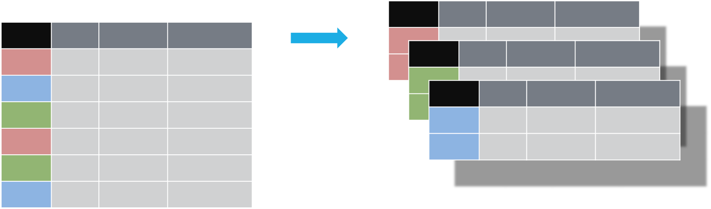
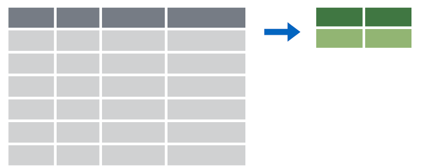

```{r setup, include=FALSE}
knitr::opts_chunk$set(echo = TRUE)
library(here)
library(tidyverse)
library(tidylog, warn.conflicts = FALSE)
library(janitor)
library(readxl)
library(lubridate)
```

## What is the tidyverse?

- According to the [tidyverse website](https://www.tidyverse.org/), "the tidyverse is an *opinionated* collection of R packages designed for data science
- Consistent interface for functions
- Special version of data frame - [tibble](http://tibble.tidyverse.org/articles/tibble.html)
  - Better printed output
  - More predictable behavior (does not change data types unexpectedly)

## Key concept: tidy data

1. Each variable must have its own column.
2. Each observation must have its own row.
3. Each value must have its own cell.

## Consider different formats for 1 data set

4 variables: 

- country
- year
- population
- cases

## Representation 1

```{r, echo=FALSE}
table2
```

## Representation 2

```{r, echo=FALSE}
table3
```

## Representation 3 - tidy

```{r, echo=FALSE}
table1
```

## Manipulating data with dplyr

[dplyr package](http://dplyr.tidyverse.org/) provides functions to manipulate data frames (tibbles)

Conceptually broad categories of manipulation:

- carve: extract variables or cases
- expand: create new columns
- collapse: summarize data

## select() allows you to select specific columns by name


## Refresher on sample data

```{r, eval = FALSE}
samples_jan <- read_csv("data/2017-01-06_s.csv",
  col_types = cols(
    compoundName = col_factor(NULL),
    sampleType = col_factor(NULL)
    )
  ) %>% 
  clean_names()
str(samples_jan)
```

## Refresher on sample data

```{r, echo = FALSE}
samples_jan <- read_csv(here::here("data/2017-01-06_s.csv"),
  col_types = cols(
    compoundName = col_factor(NULL),
    sampleType = col_factor(NULL)
    )
  ) %>% 
  clean_names()
str(samples_jan)
```

## Example: select()

```{r, eval = FALSE}
samples_jan_subset <- samples_jan %>%
  select(batch_name:expected_concentration)
head(samples_jan_subset)
```

```{r, echo = FALSE}
samples_jan_subset <- samples_jan %>%
  select(batch_name:expected_concentration)
head(samples_jan_subset)
```

## Select adjacent columns

```{r, eval = FALSE}
samples_jan_subset <- samples_jan %>%
  select(batch_name:compound_name, concentration)
head(samples_jan_subset)
```

```{r, echo = FALSE}
samples_jan_subset <- samples_jan %>%
  select(batch_name:compound_name, concentration)
head(samples_jan_subset)
```

## Drop specific columns

```{r, eval = FALSE}
samples_jan_subset <- samples_jan %>%
  select(-used_for_curve, -sample_passed)
head(samples_jan_subset)
```

```{r, echo = FALSE}
samples_jan_subset <- samples_jan %>%
  select(-used_for_curve, -sample_passed)
head(samples_jan_subset)
```

## select() combined with starts_with()

```{r}
samples_jan_vars <- samples_jan %>%
  select(starts_with("sample"))
glimpse(samples_jan_vars)
```

## filter() allows you to pick rows (cases) based on values


## Example: filter()

```{r, eval = FALSE}
samples_jan %>%
  filter(compound_name == "morphine") %>% # note the two equal signs (one equal for assignment)
  head()
```

```{r, echo = FALSE}
samples_jan %>%
  filter(compound_name == "morphine") %>% # note the two equal signs (one equal for assignment)
  head()
```

## Example: filter() based on a list

```{r, eval = FALSE}
samples_jan %>%
  filter(compound_name %in% c("morphine", "hydromorphone")) %>% # note the use of the c() function to create a list
  head()
```

```{r, echo = FALSE}
samples_jan %>%
  filter(compound_name %in% c("morphine", "hydromorphone")) %>% # note the use of the c() function to create a list
  head()
```

## Example: filter() with more than one condition

```{r}
samples_jan %>%
  filter(sample_type == "unknown", concentration > 0) %>%
  head()
```

## Example: filter() with OR condition

```{r}
samples_jan %>%
  filter(sample_type == "unknown" | concentration > 0) %>%
  head()
```

## Exercise 1

Carve the January data set in both directions. Extract sample information (batch, sample, compound) and ion ratio data for only oxycodone measurements in unknown sample types with a concentration > 0. Provide a summary of the data.

## Exercise 1 Comments

- Order of operations may be very important
- tidylog package can be helpful to clarify how each operation impacted data set

## Expanding your data set

- `mutate()` function provides a quick and clean way to add additional variables
- argument(s): name of the new column = value

## Example: mutate()

```{r, eval = FALSE}
samples_jan %>%
  filter(sample_type == "standard", expected_concentration > 0) %>%
  mutate(conc_ratio = concentration/expected_concentration) %>%
  select(batch_name:compound_name, concentration, expected_concentration, conc_ratio) %>%
  head(20)
```

## Example: mutate()

```{r, echo = FALSE}
samples_jan %>%
  filter(sample_type == "standard", expected_concentration > 0) %>%
  mutate(conc_ratio = concentration/expected_concentration) %>%
  select(batch_name:compound_name, concentration, expected_concentration, conc_ratio) %>%
  head(20)
```

## Example: mutate() with case_when() logic

```{r, eval = FALSE}
samples_jan %>%
  filter(sample_type == "standard") %>%
  mutate(
    conc_ratio = case_when(
      expected_concentration == 0 ~ (concentration + 0.001)/(expected_concentration + 0.001),
      TRUE ~ concentration/expected_concentration
    )
  ) %>%
  select(batch_name:compound_name, concentration, expected_concentration, conc_ratio) %>%
  head(20)
```

## Example: mutate() with case_when() logic

```{r, echo = FALSE}
samples_jan %>%
  filter(sample_type == "standard") %>%
  mutate(
    conc_ratio = case_when(
      expected_concentration == 0 ~ (concentration + 0.001)/(expected_concentration + 0.001),
      TRUE ~ concentration/expected_concentration
    )
  ) %>%
  select(batch_name:compound_name, concentration, expected_concentration, conc_ratio) %>%
  head(20)
```

## Example: mutate() with lubridate functions

```{r, eval = FALSE}
batch_jan <- read_csv("data/2017-01-06_b.csv") %>%
  clean_names()
batch_jan_timestamps <- batch_jan %>%
  mutate(
    collect_datetime = ymd_hms(batch_collected_timestamp),
    collect_month = month(batch_collected_timestamp),
    collect_day_of_week = wday(batch_collected_timestamp),
    collect_week = week(batch_collected_timestamp)
  )
glimpse(batch_jan_timestamps)
```

## Example: mutate() with lubridate functions

```{r, echo = FALSE}
batch_jan <- read_csv(here::here("data/2017-01-06_b.csv")) %>%
  clean_names()
batch_jan_timestamps <- batch_jan %>%
  mutate(
    collect_datetime = ymd_hms(batch_collected_timestamp),
    collect_month = month(batch_collected_timestamp),
    collect_day_of_week = wday(batch_collected_timestamp),
    collect_week = week(batch_collected_timestamp)
  )
glimpse(batch_jan_timestamps)
```

## Calculate durations with mutate()

```{r}
batch_jan_tat <- batch_jan %>%
  mutate(tat_duration = batch_collected_timestamp %--% review_complete_timestamp) %>%
  select(tat_duration)
head(batch_jan_tat)
```

## Durations with different units

```{r, eval = FALSE}
batch_jan_tat <- batch_jan %>%
  mutate(tat_duration = batch_collected_timestamp %--% review_complete_timestamp,
         tat_minutes = tat_duration / dminutes(1),
         tat_hours = tat_duration / dhours(1),
         tat_days = tat_duration / ddays(1))
```

## Durations with different units

```{r, echo = FALSE}
batch_jan_tat <- batch_jan %>%
  mutate(tat_duration = batch_collected_timestamp %--% review_complete_timestamp,
         tat_minutes = tat_duration / dminutes(1),
         tat_hours = tat_duration / dhours(1),
         tat_days = tat_duration / ddays(1))
batch_jan_tat %>% select(tat_duration, tat_minutes, tat_hours, tat_days)
```

## Exercise 2

How long an average does it take to review each batch? Using the January batch data, convert the review start timestamp and review complete timestamp fields into variables with a datetime type, then generate a new field the calculates the duration of the review in minutes. The data will need to be collapsed by batch (which I do for you using the `distinct()` function) and display the min, max, median, and mean review times.

## Collapse (summarize) your data set

- Group data by a variable using the `group_by()` function
- Couples with its summary function `summarize()`
- Allows summary calculations on specific groups within data set

## Overview of group_by() operation



## Overview of summarize() function



## Example: grouping and summarizing

```{r}
samples_jan %>%
  filter(sample_type == "unknown", concentration > 0) %>%
  group_by(compound_name) %>%
  summarize(median_ir = median(ion_ratio),
            mean_ir = mean(ion_ratio),
            std_dev_ir = sd(ion_ratio))
```

## Example: grouping and summarizing by 2 variables

```{r}
samples_jan %>%
  filter(sample_type == "unknown", concentration > 0) %>%
  group_by(batch_name, compound_name) %>%
  summarize(median_ir = median(ion_ratio),
            mean_ir = mean(ion_ratio),
            std_dev_ir = sd(ion_ratio)) %>%
  head()
```

## Example: grouping and summarizing by 3 variables

```{r}
batch_jan_timestamps %>%
  group_by(instrument_name, compound_name, collect_week) %>%
  summarize(median_cor = median(calibration_r2),
            mean_cor = mean(calibration_r2),
            min_cor = min(calibration_r2),
            max_cor = max(calibration_r2))
```

## Exercise 3

From the January sample dataset, for samples with unknown sample type, what is the minimum, median, mean, and maximum concentration for each compound by batch? What is the mean of the within-batch means by compound?

## Start with groups of batch_name and compound_name

```{r, eval = FALSE}
sample_stats_jan <- samples_jan %>%
  filter(sample_type == "unknown") %>%
  group_by(batch_name, compound_name) %>%
  summarize(min_conc = min(concentration),
            median_conc = median(concentration),
            mean_conc = mean(concentration),
            max_conc = max(concentration)
            )
```

## Grouping behavior

```{r, echo = FALSE}
sample_stats_jan <- samples_jan %>%
  filter(sample_type == "unknown") %>%
  group_by(batch_name, compound_name) %>%
  summarize(min_conc = min(concentration),
            median_conc = median(concentration),
            mean_conc = mean(concentration),
            max_conc = max(concentration)
            )
```

```{r}
head(sample_stats_jan)
```

## Run another summary without updating groups

```{r}
sample_stats_batch <- sample_stats_jan %>%
  summarize(batch_median_conc = median(median_conc))
sample_stats_batch
```

## Establish another group

```{r}
sample_stats_compound <- sample_stats_jan %>%
  group_by(compound_name) %>%
  summarize(compound_median_conc = median(median_conc))
sample_stats_compound
```

## Ungrouping helps keep downstream analysis clean

```{r}
sample_stats_jan_ungrouped <- sample_stats_jan %>%
  ungroup()
summary(sample_stats_jan_ungrouped)
```

## Scale column-wise operations with across()

```{r}
samples_jan_means <- samples_jan %>%
  group_by(sample_type, compound_name) %>%
  summarize(ion_ratio = mean(ion_ratio), 
            response = mean(response),
            concentration = mean(concentration))
```

## Scale column-wise operations with across()

```{r}
samples_jan_means <- samples_jan %>%
  group_by(sample_type, compound_name) %>%
  summarize(across(ion_ratio:concentration, mean))
```

## Scale column-wise operations with across()

```{r}
samples_jan_means
```

## Scale column-wise operations with across()

- First argument to `across()` is the column(s) to operate on
- Second argument to the `across()` function is a function or list of functions to apply to each column
- Argument will accept formulas similar to those you may use with the purrr package
  - For example `~ .x /2` to divide by 2
  - The `~` tells R to evaluate the expression following it as a function
  - The `.x` indicates a list or vector to operate on

## where() selects columns based on specific criteria

```{r}
samples_jan_means <- samples_jan %>%
  group_by(sample_type, compound_name) %>%
  summarize(across(where(is.numeric), mean))
samples_jan_means
```

## Can use na.rm argument with across()

```{r}
samples_jan_means <- samples_jan %>%
  group_by(sample_type, compound_name) %>%
  summarize(across(where(is.numeric), mean, na.rm = TRUE))
samples_jan_means
```

## across() is compatible with a list of functions

```{r}
min_max <- list(
  min = ~min(.x, na.rm = TRUE), 
  max = ~max(.x, na.rm = TRUE)
)
samples_jan_minmax <- samples_jan %>%
  group_by(sample_type, compound_name) %>%
  summarize(across(where(is.numeric), min_max))
samples_jan_minmax
```

## across() + mutate() to scale adding columns 

```{r}
samples_jan_rounded <- samples_jan %>%
  mutate(across(where(is.numeric), list(rounded = ~ round(.x, 2))))
samples_jan_rounded
```

## Exercise 4

Recall that the `floor_date()` function acts as a type of rounding function and returns a timestamp that's rounded down to a specified time unit (e.g. unit = "day" as the second argument rounds to the date). For the batch_jan data, add an additional column for every timestamp variable using the `is.POSIXct()` (to identify timestamp columns) and `floor_date()` functions.

## Shaping and tidying data with tidyr

Consider non-tidy data:

```{r, eval = FALSE}
samples_jan_messy <- read_csv("data/messy/2017-01-06-sample-messy.csv")
head(samples_jan_messy)
```

## Shaping and tidying data with tidyr

```{r, echo = FALSE}
samples_jan_messy <- read_csv(here::here("data/messy/2017-01-06-sample-messy.csv"))
head(samples_jan_messy)
```

## Gathering data with `pivot_longer()`

- `pivot_longer()` is new (and now recommended) approach
- use similar syntax, definition of arguments
  - specify the variable(s) you are gathering
  - specify the column names for the new columns that will contain the names and values you extract from the old column(s)


## Example: `pivot_longer()`

```{r}
samples_jan_tidy_longer <-samples_jan_messy %>% 
  pivot_longer(cols = c(-batch_name, -sample_name, -sample_type), 
               names_to = "compound_name", 
               values_to = "concentration")
head(samples_jan_tidy_longer)
```
*Note: names_to and values_to arguments + cols argument*

## Making data untidy

- Inverse operation of `pivot_longer()` is `pivot_wider()`
- Similar syntax:
  - Specify where new columns names come from
  - Specify where new column values come from

## Example: `pivot_wider()`

```{r}
samples_jan_remessy_wider <- samples_jan_tidy_longer %>%
  pivot_wider(names_from = "compound_name", 
              values_from = "concentration")
head(samples_jan_remessy_wider)
```
*Note: names_from and values_from arguments*

## Exercise 5

The "2017-01-06-batch-messy.csv" file in the messy subdirectory of the data dir is related to the "2017-01-06.xlsx" batch file you have worked with before. Unfortunately, it is not set up to have a single observation per row. There are two problems that need to be solved:

1. Each parameter in a batch is represented with a distinct column per compound, but all compounds appear on the same row. Each compound represents a distinct observation, so these should appear on their own rows.
1. There are 3 parameters per obsevation (compound) - calibration slope, intercept, and R^2. However these appear on different lines. All 3 parameters need to appear on the same row.


## Summary

- The dplyr package offers a number of useful functions for manipulating data sets
  - `select()` subsets columns by name and `filter()` subset rows by condition
  - `mutate()` adds additional columns, typically with calculations or logic based on other columns
  - `group_by()` and `summarize()` allow grouping by one or more variables and performing calculations within the group

## Summary

- Manipulating dates and times with the `lubridate` package can make grouping by time periods easier
- `across()` scales columnwise operations
- `pivot_longer()` and `pivot_wider()` allow you to pivot your data frame to and from a tidy data structure