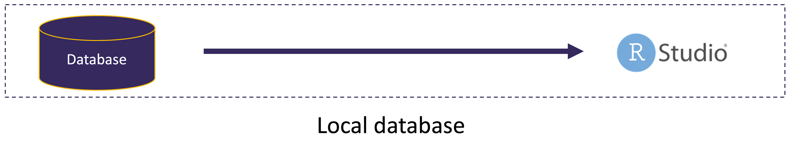
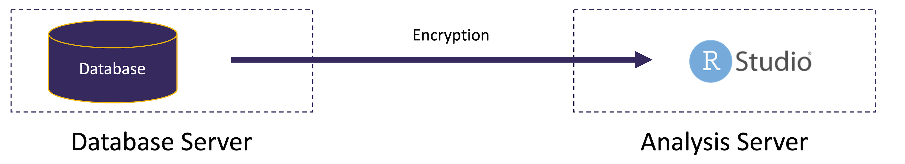

```{r setup, include=FALSE}
knitr::opts_chunk$set(echo = FALSE)
```

## Motivations for working with relational databases

- Collecting longitudinal data and want to work with a large number of files over some time period (dozens or more)
- Data set is large and exceeds the memory of the system you are analyzing data on
- Data already exists in a relational database
  - Dashboards that automatically refresh based on underlying data
  
## Configuration 1: local database


- Database is on same machine as RStudio
- May or may not require additional credentials, i.e. database may require separate username and password

## Configuration 2: database on separate server



- Database on separate server
- Very likely that separate credentials are requried to log into db

## Connecting with relational database management systems

- DBI package provides functions to connect to and perform operations on DBs
- `dbConnect()` function sets up connection with parameters specific to type of DB
- First argument indicates type of database to connect to
- Examples of types of DBs:
  - Microsoft SQL Server
  - PostgreSQL
  - MySQL
  - SQLite

## Example DB connection

```{r}
exampledb <- dbConnect(RPostgres::Postgres(),
                       host = 'hh-pgsql-public.ebi.ac.uk',   # server address
                       port = 5432,   # PostgreSQL TCP port is 5432 by default
                       dbname = 'pfmegrnargs',   # specific database to access (may be multiple dbs)
                       user = 'reader',
                       password = 'NWDMCE5xdipIjRrp')
```

## Querying a table in the DB

```{r}
rna <- tbl(exampledb, "rna")
head(rna, 10)
```

- `tbl()` points specifically to "rna" table
- Nothing is retrieved until necessary, e.g. `head()` function

## Disconnect from DB when finished

```{r}
dbDisconnect(exampledb)
```

## Exericise 1

The project dataset for the course is included in a file called "project_data.sqlite", so we will connect to this this SQLite database. 
1. Use the `dbConnect()` function to connect to this database
2. Connect to the "sample" table and view the first 10 records.
3. Perform a `summary()` on only the standards from the sample table (sample_type == 'standard') and note the minimum, median, and maximum concentrations.

## Basics of SQL

- Structured query language (SQL, pronounced both as "S-Q-L" and sequel) is the standard DB query language used by most systems
- Core principles have largely been adopted by R Tidyverse developers

## Core database concepts

- Data are represented as a group of tables, which is analagous to working with a group of data frames.
- The principles of tidy data are adapted from common relational database practices:
  - Observations are represented by rows (often called tuples in relational database speak)
  - Variables are stored in columns (commonly referred to as fields)
- Tables are linked together with variables that are shared - this principle is used to join data sets

## Basic SQL queries have 3 clauses

- SELECT clause chooses the columns to return in a query
- FROM clause chooses the table(s) from which the columns are returned
- WHERE clause specifies inclusion/exclusion criteria for rows

## Basic query

```{sql, connection = projectdb}
SELECT  
        sample_name, compound_name, ion_ratio
FROM
        sample
LIMIT
        10;
```

## Specify a subset of rows

```{sql, connection = projectdb}
SELECT  
        sample_name, compound_name, ion_ratio
FROM
        sample
WHERE
        compound_name = 'morphine'   -- Note the single quotes
```

## Join tables

```{sql, connection = projectdb}
SELECT  
        sample.*, batch.*   -- * is shorthand for return all columns
FROM
        sample
        INNER JOIN batch ON sample.batch_name = batch.batch_name
          AND sample.compound_name = batch.compound_name
LIMIT  10;
```

## Exercise 2

1. Retrieve sample and batch data (like the example above) for oxycodone (compound_name) and unknown samples (sample_type). Collect only the first 20 results.
2. Disconnect from the project database (hint: this is R code, not SQL).

## Working with databases securely

- Consider the path of data from remote server to local machine
- Avoid storing credentials to databases (especially with sensitive info) in plain text in code
  - Very important for any code that is committed to repositories
  
## Storing credentials with keyring package

- keyring package allows storage of credentials on operating system credential management system (e.g. OS X Keychain)
- Set up database password one time with `key_set()`
- Credentials can be accessed whenever user is signed into OS
  - Username called with `key_list()`
  - Password called with `key_get()`

## Example keyring configuration

```{r, eval = FALSE}
con <- dbConnect(odbc::odbc(), 
  Driver   = "SQLServer",
  Server   = "my-database",
  Port     = 1433,
  Database = "default",
  UID      = keyring::key_list("my-database")[1,2], # format to retrieve username
  PWD      = keyring::key_get("my-database")) # retrieves password
```

## Set up configuration with config package

- Alternative approach: define database connection configuration in file external from script
  - File can be restricted to only your user account (e.g. chmod 600 "filename")
- Create a config.yml file that has key value pairs for various connection properties
- Use `get()` from config package to retrieve info

## Example config.yml

```
default:
  datawarehouse:
    driver: 'Postgres' 
    server: 'mydb-test.company.com'
    uid: 'local-account'
    pwd: 'my-password'  
    port: 5432
    database: 'regional-sales'
```

## Retrieve info from config file

```{r, eval = FALSE}
dw <- config::get("datawarehouse")

con <- DBI::dbConnect(odbc::odbc(),
   Driver = dw$driver,
   Server = dw$server,
   UID    = dw$uid,
   PWD    = dw$pwd,
   Port   = dw$port,
   Database = dw$database
)
```

## Exercise 3

1. Install the config package with `install.packages("config")`.
2. Create a config.yml file in the same directory as this R Markdown document and include the following info: host, dbname, port, username, password. Note that exact names of the configuration fields are dependent on the driver (the example above is for a different type of connection than PostgreSQL).
3. Connect to the database and retrieve the first 20 entries of the rna table, similarly to what we retrieved in the original example.
4. Disconnect from the database.

## Additional resources

https://db.rstudio.com/getting-started/

## Summary

- Databases can provide better support than working with files when data sets are large or longitudinal data is collected over time.
- `dbConnect()` enables connections to databases but specific drivers are required for specific types of databases.
- Functions from dplyr can be translated to SQL to allow access to data without writing SQL queries.
- Security considerations are important for database connections, especially if sensitive information is stored - The keyring and config packages can support best practices for maintaining credentials.